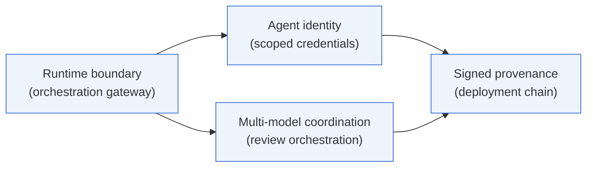

# Engineering Portfolio

Production AI systems are primarily infrastructure, governance, and runtime coordination problems — not model problems.

This is the architecture work behind that thesis: the operational primitives production AI systems need — orchestration boundaries, agent identity, multi-model coordination, signed provenance — examined through architecture studies and reference implementations.

Distinguished Software Engineer at Rapid7, working on production AI infrastructure, distributed data systems at scale, and security systems architecture.

## Perspective

**[Calling the Model Is the Easy Part](./writing/calling-the-model-is-the-easy-part.md)** — The industry is still optimizing the wrong layer of the AI stack. The hard engineering problems start when AI systems become operationally important and need to be governed, observed, bounded, deployed, debugged, and trusted.

## The primitives this work explores

The case studies explore these primitives individually; together they describe the control plane around production AI systems. The runtime boundary hosts the agent identity layer's enforcement point and the multi-model coordination flow; both feed signed events into the provenance chain that attests how a deployed artifact was produced.

## Evidence

Case studies are examples of how the ideas in the perspective piece manifest in real systems.

Each declares its status at the top — *Shipped* (running in production), *Prototype* (implemented, not yet productionized), or *Architecture study* (architecture and constraints worked through; not yet built or not yet productionized). Companion code lives in standalone repos.

- **[Production AI Orchestration Gateway](./case-studies/01-ai-orchestration-gateway.md)** — *Shipped.* FastAPI · CrewAI · AWS Bedrock. The async/sync executor-boundary pattern that turns a synchronous, framework-driven agent runtime into an operable production service. Demonstrates runtime boundaries, lifespan-scoped configuration, and three-layer observability. **Companion code:** [`orchestration-gateway-pattern`](https://github.com/ryanwilliams90/orchestration-gateway-pattern).

- **[Multi-Model Code Review Orchestrator](./case-studies/02-code-review-orchestrator.md)** — *Architecture study.* Multi-frontier-model orchestration under enterprise Zero Data Retention constraints. Demonstrates bounded escalation, explicit degradation states, semantic finding normalization, and governance of prompts and routing as versioned platform assets.

- **[Agent Identity and MCP Credential Plane](./case-studies/03-agent-identity-mcp-plane.md)** — *Prototype.* Why agent identity is harder than service identity, the operational threat model, and the gateway-mediated scoped-execution shape that closes the failure modes. Demonstrates Ed25519-signed scoped credentials, a verifier structurally separated from tool code, and a runnable demonstration of the headline rejection — a credential issued for one action cannot be used to call another. **Companion code:** [`agent-identity-mcp`](https://github.com/ryanwilliams90/agent-identity-mcp).

- **[Cryptographic Provenance for AI-Assisted Code](./case-studies/04-provenance-attestation.md)** — *Architecture study.* Why AI-assisted delivery makes "a human reviewed the PR" insufficient as a provenance model, and what an artifact-centered signed chain looks like instead. Covers the threat model, the design pattern to reject, the preferred SLSA-compatible chain, deployment / admission verification, and rollback semantics keyed on signed change-class metadata.

## Reading order

- **5 minutes:** the [perspective piece](./writing/calling-the-model-is-the-easy-part.md).
- **30 minutes:** the perspective piece, then the [orchestration gateway case study](./case-studies/01-ai-orchestration-gateway.md).
- **A full read:** all four case studies, in order.
- **Want code:** [`orchestration-gateway-pattern`](https://github.com/ryanwilliams90/orchestration-gateway-pattern) for the runtime-boundary pattern, [`agent-identity-mcp`](https://github.com/ryanwilliams90/agent-identity-mcp) for the scoped-credential demo.

---

**Contact:** ryan90@gmail.com · [LinkedIn](https://www.linkedin.com/in/ryan-williams-066b5a18/)

**Browse:** [writing/](./writing/) · [case-studies/](./case-studies/)
