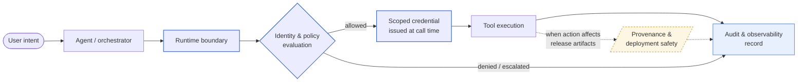

# Engineering Portfolio

Production AI systems are primarily infrastructure, governance, and runtime coordination problems — not model problems.

This portfolio is a working collection of how I think about that, with the architecture writeups and reference code that ground the perspective in real systems. Distinguished Software Engineer at Rapid7, working on production AI infrastructure, distributed data systems at scale, and security systems architecture.

## Perspective

**[Calling the Model Is the Easy Part](./writing/calling-the-model-is-the-easy-part.md)** — The industry is still optimizing the wrong layer of the AI stack. The hard engineering problems start when AI systems become operationally important and need to be governed, observed, bounded, deployed, debugged, and trusted.

## How an agent action actually moves through production

The model call is one moment along a longer execution path. Each control point in the path either has to exist or has to be missed; an agent platform's reliability and safety properties live in the points around the model call, not in the model call itself.

The diagram is descriptive of the operational shape this portfolio argues for, not a vendor stack. A few things it makes visible that prose alone obscures:

- The model call sits inside `Tool execution` — one node, late in the path. Most engineering effort has to live earlier (runtime boundary, policy evaluation, credential issuance) and downstream (audit, provenance).
- Authorization happens **at call time**, not at install time. The same agent, on the same prompt, can be allowed for one action and denied for another based on what `P` evaluates.
- Credentials are issued per action and never enter the model context. The agent receives a scoped capability, not a raw secret.
- The audit record is a primary output, not a side effect. Denials and escalations flow into it as well, so "what did the agent try?" is answerable, not just "what did the agent succeed at?"
- Provenance is downstream and conditional — engaged when the action affects release artifacts or production state, not on every call.

The dashed border on `V` reflects that the provenance/deployment-safety leg is in design rather than shipped in this portfolio yet.

## Evidence

Case studies are examples of how the ideas in the perspective piece manifest in real systems. Each declares its status at the top — *Shipped* (running in production), *Prototype* (implemented, not yet productionized), or *Design* (architecture and constraints worked through, implementation not yet started). Companion code lives in standalone repos.

- **[Production AI Orchestration Gateway](./case-studies/01-ai-orchestration-gateway.md)** — *Shipped.* FastAPI · CrewAI · AWS Bedrock. The async/sync executor-boundary pattern that turns a synchronous, framework-driven agent runtime into an operable production service. Demonstrates runtime boundaries, lifespan-scoped configuration, and three-layer observability. **Companion code:** [`orchestration-gateway-pattern`](https://github.com/ryanwilliams90/orchestration-gateway-pattern).

- **[Multi-Model Code Review Orchestrator](./case-studies/03-code-review-orchestrator.md)** — *Design.* Multi-frontier-model orchestration under enterprise Zero Data Retention constraints. Demonstrates bounded escalation, explicit degradation states, semantic finding normalization, and governance of prompts and routing as versioned platform assets.

- **[Agent Identity and MCP Credential Plane](./case-studies/04-agent-identity-mcp-plane.md)** — *Design note.* Why agent identity is harder than service identity, what the operational threat model actually is, and the gateway-mediated scoped-execution shape that closes those failure modes. Argues that scoped execution is the operating model for agent platforms, not a security feature retrofitted later.

A further case study on cryptographic provenance for AI-assisted code is in development.

## Background

Areas of focus:

- AI orchestration and runtime systems
- Agent identity and credential planes
- Cryptographic provenance and attestation
- Distributed data systems (Apache Iceberg, Trino, large-scale security telemetry)
- Operational reliability for AI in production
- Security systems (SOC alert dispositioning, detection metadata enrichment, vulnerability risk scoring)
