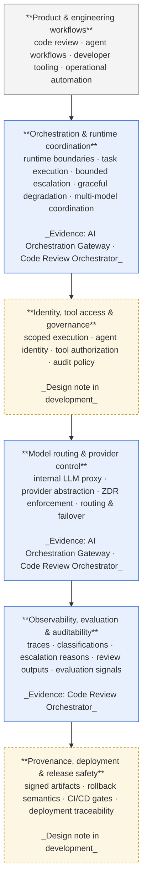

# Engineering Portfolio

Production AI systems are primarily infrastructure, governance, and runtime coordination problems — not model problems.

This portfolio is a working collection of how I think about that, with the architecture writeups and reference code that ground the perspective in real systems. Distinguished Software Engineer at Rapid7, working on production AI infrastructure, distributed data systems at scale, and security systems architecture.

## Perspective

**[Calling the Model Is the Easy Part](./writing/calling-the-model-is-the-easy-part.md)** — The industry is still optimizing the wrong layer of the AI stack. The hard engineering problems start when AI systems become operationally important and need to be governed, observed, bounded, deployed, debugged, and trusted.

## The operational substrate

The layers below are the parts of production AI infrastructure where the hard engineering problems actually live. The case studies in this portfolio are evidence of how a few of these layers behave in real systems; the others are areas of active work.

Layers shown in solid blue have at least one case study or reference implementation in this portfolio. Layers shown with a dashed amber border are areas where design work is in progress but a writeup hasn't shipped yet. The diagram is intentionally not a vendor-style "AI platform" stack — these are the *operational* concerns that determine whether an AI system is safe to run in production, irrespective of which models it's calling.

## Evidence

Case studies are examples of how the ideas in the perspective piece manifest in real systems. Each declares its status at the top — *Shipped* (running in production), *Prototype* (implemented, not yet productionized), or *Design* (architecture and constraints worked through, implementation not yet started). Companion code lives in standalone repos.

- **[Production AI Orchestration Gateway](./case-studies/01-ai-orchestration-gateway.md)** — *Shipped.* FastAPI · CrewAI · AWS Bedrock. The async/sync executor-boundary pattern that turns a synchronous, framework-driven agent runtime into an operable production service. Demonstrates runtime boundaries, lifespan-scoped configuration, and three-layer observability. **Companion code:** [`orchestration-gateway-pattern`](https://github.com/ryanwilliams90/orchestration-gateway-pattern).

- **[Multi-Model Code Review Orchestrator](./case-studies/03-code-review-orchestrator.md)** — *Design.* Multi-frontier-model orchestration under enterprise Zero Data Retention constraints. Demonstrates bounded escalation, explicit degradation states, semantic finding normalization, and governance of prompts and routing as versioned platform assets.

Further case studies on agent identity / MCP credential planes and cryptographic provenance for AI-assisted code are in development.

## Background

Areas of focus: AI orchestration and runtime systems · agent identity and credential planes · cryptographic provenance and attestation · distributed data systems (Apache Iceberg, Trino, large-scale security telemetry) · operational reliability for AI in production · security systems (SOC alert dispositioning, detection metadata enrichment, vulnerability risk scoring).
