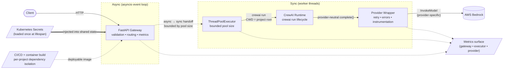

# Production AI Orchestration Gateway

**Status:** Shipped
**Stack:** FastAPI · CrewAI · AWS Bedrock · Kubernetes · LiteLLM-style provider abstraction
**Companion code:** [`ryanwilliams90/orchestration-gateway-pattern`](https://github.com/ryanwilliams90/orchestration-gateway-pattern) — clean-room reference implementation of the async/sync boundary pattern, with mypy-strict typing, lint-clean code, and a test suite that pins the boundary properties (concurrency bounds, timeout honesty, ContextVar propagation, retry semantics).

> This case study is a worked example of the runtime-boundary problem described in [Calling the Model Is the Easy Part](../writing/calling-the-model-is-the-easy-part.md). The gateway is evidence that production AI systems need explicit runtime boundaries: the model call was not the hard part; the hard part was turning a synchronous, framework-driven agent runtime into something that could behave like an operable service.

## Executive summary

A FastAPI-based orchestration gateway that exposes CrewAI agent workflows as production services backed by AWS Bedrock. The gateway separates the consumer-facing API surface from the orchestration runtime, isolates blocking agent execution behind a thread-executor boundary, centralizes Kubernetes-managed secrets at lifespan startup, and contains provider-specific code behind a wrapper layer.

The interesting work in this system is not the agent logic. It is the boundary engineering: matching a synchronous, long-running, framework-driven runtime to an async HTTP service without bleeding the runtime's failure modes into the API contract, the deployment pipeline, or the operator's debugging workflow. Most of the design exists to make the orchestration runtime *legible* — bounded in concurrency, predictable in initialization, observable end-to-end, and contained at well-understood seams.

## Context

CrewAI workflows started as project-local runtimes — scripts and notebooks invoked directly, with `.env` files, ad-hoc credentials, and per-developer Python environments. Production use forced a different question: what does a service boundary around this look like, given that the underlying runtime was never designed to be one?

Concretely, that meant a single FastAPI service had to dispatch into multiple CrewAI projects, each with its own dependency tree and entrypoint, while presenting a stable HTTP contract; agent execution had to coexist with health checks and metrics scrapes on the same process; secrets had to land in the runtime through Kubernetes rather than developer-shell environment variables; and the whole thing had to ship through standard container-based CI/CD, not a notebook.

The brief was narrow on purpose: build the service boundary, do not fork or monkey-patch the framework, and do not couple the consumer-facing API to CrewAI's internal abstractions.

## Constraints

- **Framework lifecycle.** CrewAI projects are designed to be invoked through `crewai run`. That entrypoint sets up plugin discovery, telemetry hooks, and project-relative working-directory expectations. Importing project modules directly skips that setup; the workflow may run, but with a different initialization order than the framework's own tests assume. Drift surfaces as missing tool registrations, wrong CWD-relative file lookups, or telemetry that silently no-ops.
- **Synchronous, long-running execution.** A CrewAI run is a sequence of model calls, tool invocations, and inter-agent dispatch — all of it blocking from Python's perspective and bounded only by the workflow's own time budget. Calling it from an async handler without a boundary blocks the event loop for the entire run.
- **Multi-project isolation.** Multiple CrewAI projects must coexist behind one gateway. Each project has its own dependency pin set; merging them into a single resolved environment is not viable, because pinned-version conflicts between projects (e.g., divergent `litellm`, `pydantic`, or model SDK versions) are routine.
- **Secrets via Kubernetes.** Credentials — Bedrock IAM, third-party APIs used inside agents — arrive as mounted secrets or projected env vars. The runtime cannot read from a developer's shell, a `.env` file, or a metadata service it does not have IAM access to.
- **Provider portability.** Bedrock is the current backend. The cost of a future provider change should be in the wrapper layer, not in agent code, prompt templates, or error handling at every call site.
- **Container-first deployment.** Reproducible image builds, deterministic dependency resolution, single-image-per-deploy. No "install at startup," no host Python.

## Architecture

Four layers, each with a single responsibility and an explicit boundary to the next. The boundaries are the design; the layers themselves are off-the-shelf.

### 1. API gateway (FastAPI)

The consumer-facing surface. Validates requests, normalizes responses (`ORJSONResponse` for predictable serialization of orchestration outputs that include nested model objects), exposes a Prometheus-compatible metrics endpoint, and routes to orchestration entrypoints.

The gateway uses FastAPI's async lifespan hook for one-time startup work: secret loading, provider wrapper construction, executor pool initialization, and a project-registry build that maps inbound route → project entrypoint. Requests are not served until the lifespan startup completes; if any of those steps fail, the process exits before the readiness probe ever passes. This makes "running but misconfigured" — the most expensive failure mode in production — structurally impossible.

The gateway never blocks the event loop. Anything that calls into the orchestration runtime crosses the executor boundary first. Handlers themselves do almost nothing: parse, validate, hand off, await result, serialize.

### 2. Executor boundary

A `ThreadPoolExecutor` with a fixed pool size sits between async request handlers and the synchronous orchestration runtime. Handlers submit a callable that wraps the `crewai run`-equivalent invocation and `await` its future via `loop.run_in_executor`. From asyncio's perspective, the call is a single suspended coroutine; from the runtime's perspective, it is a synchronous function executing on a dedicated worker thread.

This boundary does several specific things:

- **Keeps the event loop responsive.** Health checks, metrics scrapes, and unrelated requests continue to be served while a workflow runs. Without the boundary, a long blocking call inside a handler stalls every other coroutine on that worker — the classic head-of-line blocking failure that looks fine in single-request load tests and falls over the moment two requests arrive concurrently.
- **Bounds concurrency to a number you chose.** The pool size is the workflow concurrency limit, full stop. There is no implicit ceiling from event-loop scheduling, no surprise from thread auto-scaling. Saturation manifests as `Future` objects queued behind the pool, which is observable, rather than as creeping latency on the loop, which is not.
- **Localizes the blocking surface.** Every blocking thing the runtime does — Bedrock SDK calls, file I/O for prompt templates, subprocess invocations made by tools — happens on a worker thread. The async layer never sees it.

The pool size is a deployment-time decision driven by three things: per-workflow peak memory (orchestration runs with multiple agents and tool outputs are not cheap), the Bedrock account/region concurrency ceiling for the model in use, and the pod's CPU and memory request. Sizing it from request volume alone is wrong; sizing it from any one of those three alone is also wrong.

### 3. Orchestration runtime (CrewAI)

CrewAI projects execute through the framework's supported entrypoint, not via direct module imports. The reasons are not aesthetic:

- **Initialization order.** `crewai run` discovers and registers tools, agents, and tasks in an order the framework's own tests assume. Importing the project module bypasses that and produces a runtime that *mostly* works — until a tool is invoked that was supposed to register itself during the lifecycle hook that never fired.
- **Working-directory assumptions.** Several configuration loads inside CrewAI projects are CWD-relative (YAML for agents/tasks, prompt template files). The framework's entrypoint sets CWD to the project root; a direct import does not.
- **Telemetry and plugin hooks.** The framework's own tracing and plugin systems wire up during the entrypoint. Bypassing it produces silent gaps in instrumentation that are hard to detect because nothing errors.

Each CrewAI project is packaged with its own pinned dependencies. The gateway dispatches by project identifier in the request to the appropriate entrypoint without sharing process-level state across projects. (Note: dependency *isolation* between projects is enforced at build time — each project's resolved dependency tree is fixed in the image. True per-project process isolation is a future-improvement item; today, projects share a Python interpreter, which is sufficient given that pinned dependencies are vetted together at build time.)

### 4. Model provider layer (LiteLLM-style wrapper over Bedrock)

Model invocations go through a thin wrapper that follows LiteLLM-style provider abstraction patterns: a single `complete()`-style entrypoint that accepts a model identifier and returns a normalized response shape, with provider-specific concerns (Bedrock's `invoke_model` request envelope, response stream parsing, model-family-specific message formatting) contained inside.

The wrapper is the right home for several concerns that, left to call sites, scatter and drift:

- **Error normalization.** Bedrock surfaces a small zoo of failure types: `ThrottlingException`, `ModelTimeoutException`, `ModelStreamErrorException`, `ValidationException`, transport-layer `EndpointConnectionError`s, and more. Orchestration code wants two things: "retryable" or "not." The wrapper makes that distinction and exposes a stable taxonomy.
- **Retry policy.** Throttling and transient transport errors get bounded exponential backoff with jitter. The wrapper enforces a per-call retry budget; orchestration code does not retry on its own, which prevents accidental compounding (a 3-step workflow with retries-at-every-layer can multiply a single throttling event into a thirty-second stall).
- **Instrumentation.** Per-call latency, retry count, model id, input/output token counts, and outcome are emitted from one place. Without the wrapper, instrumentation lives at every Bedrock call site and is inconsistent within a week.

### Runtime configuration and secrets

Secrets are loaded once during the FastAPI lifespan from Kubernetes-mounted sources (mounted secret volumes and projected env vars) and injected into shared runtime state held on the application object. Handlers, orchestration code, and the provider wrapper read from that state — they do not reach into `os.environ`, the filesystem, or any secret store on each request.

This matters for three concrete reasons:

- **Latency.** Per-request secret resolution adds tail latency that scales with the number of secrets and the underlying lookup mechanism. Centralizing it removes the variance.
- **Failure semantics.** If credential resolution fails, it should fail at startup with the readiness probe still red — not on the 47th request to a specific endpoint. Centralized loading turns a per-request failure mode into a deploy-time failure mode.
- **Auditability.** There is exactly one path through which secrets enter the process. Reasoning about credential exposure (logs, error messages, debug dumps) becomes tractable.

## Key engineering decisions

### Separate the API surface from the orchestration runtime

The most important boundary in the system is the one between consumer-facing API concerns (validation, error shapes, status codes, metrics, auth) and orchestration internals (CrewAI lifecycle, agent state, tool invocations, model calls). Collapsing them — exposing `Crew` or `Agent` primitives directly through HTTP — would have made the framework's internal abstractions part of the public contract. Provider changes, framework upgrades, even renaming an internal field would then ripple to consumers.

The gateway's request/response schemas are defined in terms of the *task* the consumer wants done, not the framework that happens to do it. Replacing CrewAI underneath would not change a single byte on the wire.

### Use an executor boundary for blocking orchestration

Agent workflows do not fit the async-everywhere model. Several attempts to async-ify synchronous agent frameworks exist; they tend to produce systems where most calls are `async def` but eventually call something blocking, and the blocking call is the one that matters. Rather than fight the framework, blocking work runs on a thread pool with explicit concurrency limits.

A consequence worth naming: the executor boundary forces orchestration code to be thread-safe in the narrow sense that two concurrent runs do not share mutable state through module globals. CrewAI projects that relied on module-level singletons during development needed adjustment. This is a feature, not a bug — the alternative is running multiple workflows that silently corrupt each other's state.

### Respect the framework lifecycle

CrewAI projects run through the framework entrypoint, not via direct imports. Bypassing the lifecycle is cheap in development (the workflow runs, the test passes) and expensive in production (intermittent missing tools, wrong CWD-relative paths, silently-disabled telemetry). The supported entrypoint is the only configuration the framework's own maintainers test against; running it any other way means owning the divergence yourself.

### Abstract the provider, don't embed it

Bedrock-specific behavior — the request envelope shape, response parsing, model-family-specific message formatting, the SDK exception taxonomy — lives behind a wrapper. Orchestration code calls a provider-neutral interface. This is not speculative portability. It is where instrumentation, retry policy, and error normalization belong, and keeping them in one place avoids the drift that occurs when each call site invents its own approach.

A specific class of problem this prevents: when one orchestration module retries on `ThrottlingException` and another does not, throttling under load produces inconsistent behavior that is genuinely hard to debug because the *symptom* (some requests stall, others fail fast) does not point at the *cause* (inconsistent retry policy across call sites).

### Centralize secret loading at lifespan

Secrets are loaded once at startup, not per-request and not lazily inside handlers. This trades a small amount of startup latency for deterministic runtime behavior and a single auditable code path for credential entry. Per-request secret access is a per-request failure mode and a per-request latency tail; lazy loading inside a handler is also a race condition waiting to happen the first time two concurrent requests trigger it on a cold worker.

## Operational considerations

### Timeout layering

There are four timeouts that have to be reasoned about together, and they have to agree:

1. **Client-side timeout** (the caller's HTTP client).
2. **Load balancer / ingress idle timeout** (often 60s by default; almost always too short for an agent run).
3. **FastAPI/uvicorn request timeout** (whatever the server is configured to allow).
4. **Orchestration time budget** (enforced inside the executor task — the runtime's own ceiling on a single workflow).

If any of the outer three are shorter than the orchestration budget, the workflow keeps running after the client has given up, and the executor slot stays occupied. If the orchestration budget is missing or longer than expected, a runaway workflow can hold an executor slot indefinitely. The orchestration budget must be the shortest, enforced inside the work, and shorter than every layer above it.

### Concurrency and saturation

Concurrency is bounded by the executor pool size. When the pool saturates, new requests sit in the executor's internal queue (a `queue.Queue` inside the `ThreadPoolExecutor`). From the API's perspective this looks like elevated request latency with no errors — health checks still pass, metrics scrape still works, the API responds to other endpoints. From a consumer's perspective, requests get slower until they time out at the client.

This failure mode is invisible without explicit instrumentation of pool state. The metrics surface exposes pool active count, queued task count, and submission rate; saturation is detected by queued count rising, not by error rate.

### Bedrock integration realities

Several things about Bedrock specifically shape the wrapper's design:

- **Throttling is a regular operating condition, not an error.** `ThrottlingException` happens under normal load when account or per-model concurrency limits are hit. Treating it as a hard failure produces a system that fails under exactly the conditions it should handle gracefully. Bounded retry with jitter is the baseline.
- **Tail latency is wide.** Even at modest concurrency, p99 model latency can be many multiples of the median. The wrapper's per-call latency metric is histogram-based, not averages, because averages hide the tail completely.
- **Streaming versus non-streaming.** Streaming and non-streaming Bedrock invocations have different SDK call shapes and different exception surfaces. The wrapper exposes one of those modes per integration to keep the call-site contract narrow; mixing modes inside orchestration code is a source of subtle bugs (e.g., a streaming response consumed twice, or a non-streaming response treated as iterable).
- **Region and model-id coupling.** Bedrock model identifiers are region-scoped, and IAM scoping for `bedrock:InvokeModel` is per-model-arn. The wrapper holds the model→region→arn mapping in one place, which avoids the alternative of every call site constructing it from string parts.

### Deployment and dependency management

Each CrewAI project's dependencies are resolved at image build time, not at startup. The image build uses a deterministic resolver (locked dependency files), and the resulting set of packages is fixed for the life of that image tag. Two specific consequences:

- **No "works on my laptop, fails in prod" via dependency drift.** The image is the artifact; if it builds, the dependency graph is what shipped.
- **Project upgrades are deliberate.** Bumping a transitive dependency is a build-pipeline change, reviewed and tested, not a side effect of a redeploy at an inconvenient moment.

The base image carries the Python version and OS-level dependencies; project-specific layers carry the project's resolved Python dependencies. Layer ordering is deliberate so that day-to-day prompt or agent-config changes do not invalidate the heavy dependency layer cache.

### Observability layering

Three levels of metrics together describe the system; any one level alone is misleading.

- **Gateway level.** Request rate, latency histogram, status code distribution, in-flight count. Standard service health.
- **Executor level.** Pool active threads, queued tasks, submission rate, task duration histogram. This is where saturation is visible.
- **Provider level.** Per-call latency histogram (broken out by model id and outcome), retry counts, throttling event count, token counts in and out. This is where Bedrock-side problems are visible.

A common debugging pattern: gateway latency rises, error rate is flat, request rate is steady. The cause is almost always at the executor level (saturation) or provider level (throttling slowing each call), not the gateway. Without the lower-level metrics, the diagnosis is guesswork.

### Debugging realities

Several things are genuinely harder to debug in this system than in a stateless web service, and the design accommodates that rather than pretending otherwise:

- **Stack traces cross the executor boundary.** A failure in CrewAI surfaces in the executor thread, gets re-raised on the awaited future in the handler, and is logged from there. The original frame is preserved (Python's exception chaining handles this), but log readers have to know to look for the cause traceback rather than stopping at the handler-level frame.
- **A workflow's "current step" is not in the request log.** A request that has been running for forty seconds has done some indeterminate amount of work inside the runtime. The metrics surface exposes per-call provider events, which is the closest thing to a heartbeat available without reaching into the runtime's internals.
- **Reproducing a failure often requires the exact prompt/context the workflow assembled.** The provider wrapper logs request hashes and (where appropriate) prompt sizes; full prompt logging is gated behind a debug flag because the prompts can contain sensitive data and are large.

## Lessons learned

- **Production AI systems are operational infrastructure problems.** The model is the smallest part of the surface area. Boundaries, lifecycles, secrets, observability, and deployment are most of the work, and most of what makes the system survive contact with real traffic.
- **Async assumptions don't transfer to agent runtimes.** Blocking orchestration on the event loop is the kind of mistake that looks fine in development and produces head-of-line blocking the moment two requests arrive together. The executor boundary is non-negotiable, and the cost of getting it wrong is a system that fails specifically under the conditions you built it for.
- **Framework lifecycle bypasses are debt.** Running a framework through its supported entrypoint is rarely the most elegant option, and almost always the right one. Skipped initialization shows up as missing tool registrations, wrong-CWD config loads, and silent telemetry gaps — all of which are cheap to live with and expensive to debug.
- **Provider abstraction earns its keep before the second provider arrives.** Even with one backend, the wrapper is the right home for instrumentation, error normalization, and retry policy. Embedding Bedrock calls inline scatters those concerns; within weeks they are inconsistent across modules and the system has multiple competing definitions of "retry."
- **Centralized secret loading is a reliability decision, not a security one.** The security argument is real, but the operational argument is stronger: per-request credential resolution is per-request latency variance and per-request failure surface. Loading at lifespan turns runtime credential issues into deploy-time failures, where they belong.
- **The metrics that matter live one layer below where the problem appears.** Gateway latency rises because executors are saturated. Executors saturate because Bedrock is throttling. Bedrock throttles because the workload changed shape. Without the lower-level metrics, every incident is a hypothesis.

## Future improvements

Extensibility points the design accommodates but the current implementation does not yet exercise:

- **Structured execution tracing.** Per-workflow trace context propagated through the executor boundary into the runtime and the model wrapper, so a single trace covers handler entry, executor submission, runtime steps, and every Bedrock call. Today, the three layers' instrumentation is correlated by request id, which is workable but coarser than spans.
- **Per-project process isolation.** Move from shared-interpreter, build-time-isolated dependencies to per-project worker processes. The motivation is two-fold: harder isolation guarantees (one project cannot import-time-monkey-patch another) and per-project memory accounting under the executor.
- **Distributed task execution.** Move the executor boundary out of process — to a queue-backed worker pool — for workloads that exceed single-node executor capacity. The current design contains nothing that prevents this; the wrapper, runtime, and gateway all stay where they are, and the boundary moves from a thread pool to a queue.
- **Provider-aware failover and routing.** Use the wrapper layer to route by latency, cost, or capability across providers. The error-normalization work is the prerequisite; routing on top of it is mechanical.
- **Admission control at the gateway.** Explicit queueing with priority classes, instead of relying on the executor's internal queue. This makes priority observable and gives a place to apply backpressure to specific request classes rather than the whole system.
- **Cost-aware routing.** Per-call cost accounting in the wrapper, feeding routing decisions and budget enforcement at the workflow level.
- **Per-step orchestration telemetry.** Heartbeat-style events from inside the runtime, surfaced through the same metrics pipeline as gateway and provider metrics. This is the missing piece that makes a forty-second in-flight workflow legible.

## Architecture diagram

The diagram's job is to make the runtime boundaries visible. The dashed `Async / Sync` boxes are the most important feature: a reader should be able to point at exactly where the event loop ends and worker threads begin. Annotations on each arrow describe what changes across it — async-to-sync at the executor boundary, framework lifecycle entry into the runtime, provider-neutral interface at the wrapper, provider-specific invocation only in the final hop.

Side flows show that secrets enter exactly once (at lifespan, not per-request), metrics are fed from three distinct layers (gateway, executor, wrapper — each contributing different signals), and the deployable artifact is produced by CI/CD with per-project dependency isolation enforced at build time.
