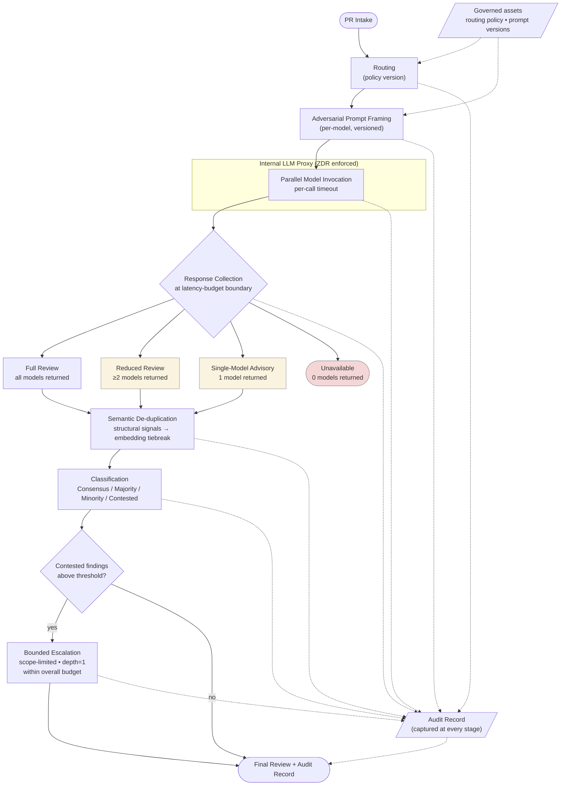

# Multi-Model Code Review Orchestrator

**Status:** Design
**Stack:** self-hosted orchestration · multiple frontier model providers · internal LLM proxy · enterprise Zero Data Retention controls

> This case study is a worked example of the multi-model coordination problem described in [Calling the Model Is the Easy Part](../writing/calling-the-model-is-the-easy-part.md). The orchestrator is evidence that multi-model AI systems are coordination systems, not just parallel API calls. The hard problems were bounded latency, semantic finding normalization, explicit degradation behavior, and governance of prompts and routing as versioned platform assets — not the model calls themselves.

> This case study describes architecture and design intent. The system is not in production. Where behavior is described, it is the *intended* runtime behavior of the design — anticipated failure modes, planned operational semantics — not observed characteristics. Sections that would normally describe production telemetry instead describe the properties the design must hold to be operable.

## Executive summary

A self-hosted orchestration layer that fans a single code review request out across multiple frontier models, normalizes their findings semantically before any classification logic runs, classifies the resulting findings into operationally meaningful categories (Consensus / Majority / Minority / Contested), bounds any deeper deliberation behind explicit latency and cost budgets, and degrades predictably when providers fail rather than blocking the developer workflow.

The orchestrator is designed for use inside an enterprise SDLC where Zero Data Retention is a hard constraint — model traffic moves through an internal LLM proxy, and routing, prompt versioning, and provider selection are governed centrally rather than chosen per call site.

The hard problem in the design is not invoking multiple models. It is preventing the obvious failure modes of doing so: duplicated findings phrased differently inflating noise, identical prompts producing artificial consensus, recursive deliberation expanding latency unpredictably, and a single vendor outage halting the review pipeline. The architecture treats those as the primary problem space and the model calls themselves as a small part of the surface area.

## Context

Single-model code review has known structural limits: vendor-specific blind spots, vendor-specific failure modes, and a single point of dependency for a workflow that engineering teams begin to rely on. The natural response — call several models — introduces a different and worse problem if implemented naively: the same finding appears three times in slightly different prose, "majority agreement" emerges from prompt similarity rather than independent reasoning, and a one-minute review becomes a five-minute review because the slowest provider sets the latency floor.

The orchestrator's purpose is to make multi-model review a runtime coordination system rather than a fan-out wrapper. That distinction shows up in every section below: classification has operational meaning, deliberation is budgeted, degradation is a designed path, and prompts are governed assets rather than embedded strings.

## Constraints

- **Zero Data Retention.** All provider traffic transits the internal LLM proxy. The orchestrator does not bypass it, does not call provider SDKs directly, and does not maintain its own credential store for upstream providers. Provider selection and routing are choices the proxy understands and audits.
- **Bounded developer-loop latency.** A code review must return inside a budget that fits an engineering workflow. A multi-round deliberation that produces excellent findings ten minutes after the developer has context-switched is, operationally, a failed review.
- **Vendor independence.** No single provider's outage halts the pipeline. Degraded review is preferable to no review.
- **Deterministic classification semantics.** Consensus / Majority / Minority / Contested must mean the same thing across runs. A finding that would be classified `Consensus` in one run cannot be `Majority` in another with the same inputs.
- **Semantic equivalence is the unit of analysis, not exact wording.** Two providers describing the same null-pointer risk in different prose are one finding, not two.
- **Centralized prompt and routing governance.** Prompts, model selection, and provider routing are versioned and reviewed. Per-call-site improvisation is explicitly out of scope.
- **Cost predictability.** Multi-model fan-out and any deeper deliberation must have predictable upper bounds on token usage per review.

## Architecture

The system is organized as a pipeline with explicit, named stages. Each stage has a single responsibility and a clearly defined input and output shape. The stage boundaries exist so that classification cannot run before normalization, escalation cannot bypass the latency budget, and degradation has well-defined fallback states rather than implicit ones.

### 1. Request intake and routing

A review request — typically a PR diff plus surrounding context — enters the orchestrator. The orchestrator resolves which set of models to fan out to using a centrally governed routing policy. Routing policy is a versioned artifact, not a hardcoded list; changes go through review.

The orchestrator does not call providers directly. It calls the internal LLM proxy, which enforces ZDR and handles credential and provider selection. From the orchestrator's perspective, providers are addressed by logical model identifier; the proxy resolves the rest.

### 2. Adversarial prompt framing

Each model receives a different review framing — for example, security-focused, correctness-focused, reliability-focused, maintainability-focused. The framing is not a stylistic choice; it is the design's countermeasure to a specific failure mode of identical-prompt fan-out: models trained on overlapping data, asked the same question, tend to converge on the same superficial reasoning. Identical prompts produce artificial consensus, which is worse than no consensus because it is indistinguishable from real agreement.

Prompts and framings are versioned artifacts. A prompt change is a governed event, because prompt changes can materially shift disagreement rates, classification distributions, and escalation frequency — that is, the prompts are operational infrastructure, and treating them as static strings embedded in code surrenders the ability to reason about why review behavior changed across deployments.

### 3. Parallel model invocation

The orchestrator fans out to the selected models concurrently through the proxy. Each call carries an individual timeout drawn from the overall latency budget, not a global one — a slow provider must be allowed to be slow without holding up the others past the per-call ceiling.

Each call's outcome is one of: returned-in-budget, returned-late (after per-call timeout), failed (provider error), or refused (proxy or policy denial). The collection stage observes all four outcomes; "missing" is a first-class signal, not an exception.

### 4. Response collection with degradation

Collection waits up to the overall latency budget for the calls. The stage does not wait for all calls to complete before proceeding — it proceeds with whatever has returned by the budget boundary, in one of the designed degradation states:

- **Full multi-model review.** All selected models returned in budget.
- **Reduced multi-model review.** Some models returned, at least two. Classification proceeds with the reduced set; the output explicitly records the reduced participant set, because `Consensus` over two providers means something different than `Consensus` over four.
- **Single-model advisory.** Only one model returned. The output is degraded to advisory mode, classification semantics do not apply, and the review is labeled accordingly.
- **Fallback operational mode.** No models returned in budget. The orchestrator returns a structured "review unavailable" result with the cause; the calling system decides whether to retry, skip, or block. The orchestrator itself does not block the workflow.

The point of degradation states being explicit is that consumers of the review output can reason about what they are looking at. A `Majority` classification that quietly came from two providers when the design assumes four is a misleading signal; making the participant set part of the output is the design's defense against that.

### 5. Semantic de-duplication and normalization

Before any classification logic runs, findings from the surviving providers are grouped by semantic equivalence. Two findings that describe the same defect — same location, same root cause, same fix surface — are one finding regardless of wording.

This stage exists because naive majority counting over raw findings is structurally broken: it inflates noise, manufactures false disagreement (when two models describe the same issue with different phrasing, naive counting calls that "Minority"), and conflates wording variation with reasoning variation.

The grouping is the design's most architecturally load-bearing component, and also the one with the most open questions. Embedding-based clustering has clear failure modes (semantically related but distinct findings collapse into one); rule-based normalization on issue location plus category is more conservative but misses cases where two providers identify the same issue with different stated locations. The intended approach is layered: structural signals first (file, line range, issue category), embedding similarity as a tiebreaker, with explicit thresholds and an audit trail of which signals matched. Tuning those thresholds is one of the system's primary calibration tasks.

### 6. Classification

Normalized finding groups are classified using the surviving participant set:

- **Consensus** — all surviving providers raised this finding.
- **Majority** — more than half raised it.
- **Minority** — at least one but not a majority.
- **Contested** — at least one provider raised it and at least one explicitly contradicted it (not merely failed to mention it).

The Minority/Contested distinction is the one that matters most operationally. "One provider mentioned it, the others didn't" is a different signal than "one provider raised it and another argued it was a non-issue." The design depends on the prompt framings producing explicit disagreement signals where they exist, rather than silence-as-disagreement. This is one of the design's calibration burdens.

Classification is deterministic given the same inputs and the same surviving participant set. Random sampling, temperature variation, or order-dependent logic in this stage would break the design's auditability story.

### 7. Bounded escalation for contested findings

`Contested` findings — the ones where providers disagreed with each other, not merely with silence — may trigger a second, scoped deliberation pass. The pass is bounded explicitly:

- **Latency-budgeted.** The escalation has its own time budget that is part of, not additional to, the overall review budget.
- **Scope-restricted.** Escalation operates on the contested finding(s) specifically, not on the full review.
- **Depth-capped.** No more than one escalation round. Recursive deliberation is structurally disallowed; the design treats unbounded recursion as the failure mode it is.
- **Conditional.** Escalation only triggers above a contested-finding threshold, not for every disagreement.

The output of escalation is incorporated into the final review with explicit provenance — a reader can tell which findings went through the deeper pass and what changed.

### 8. Final review assembly and audit record

The final output bundles classified findings, the participant set actually used, the escalation outcomes, and a structured audit record of which provider said what, which prompt versions were in effect, and which routing policy was applied. The audit record is the design's answer to "why did this review look like this?" — without it, every change in review behavior is unexplained.

## Key engineering decisions

### Treat orchestration as a coordination problem, not an integration problem

The difficult part of multi-model review is coordination, classification, semantic normalization, latency budgeting, and degradation behavior. The model calls themselves are a small fraction of the design surface. Building this as a thin API wrapper would defer every hard problem to runtime, where they would emerge as inconsistent behavior across review runs and incidents that are difficult to diagnose because the system has no internal vocabulary for what went wrong.

### Normalize findings before classifying them

Naive majority voting over raw findings is structurally wrong. Two providers describing the same defect with different prose are one finding; a system that counts them as two is producing noise dressed as signal. The de-duplication stage runs before classification, with explicit signals (location, category) preferred over embedding similarity as the primary grouping mechanism. The design's auditability depends on being able to explain, after the fact, why two findings were grouped or kept separate.

### Make the participant set part of the output

`Consensus` is not a fixed concept; it is a function of how many providers participated. Degraded runs that quietly relabel two-provider agreement as `Consensus` produce a system whose classifications mean different things on different days. The participant set travels with the classification so consumers can reason about what they are reading.

### Bound escalation explicitly; disallow recursion

Recursive deliberation is the failure mode of any multi-agent reasoning system that is not designed to prevent it. The escalation path has a fixed depth (one round), a fixed scope (contested findings only), and a latency budget that is part of, not additional to, the overall budget. Unconstrained "let the models think harder" loops are not present in the design and not a planned future addition.

### Degrade rather than fail

The orchestrator is designed for a developer workflow where blocking the workflow is the worst outcome. Every stage has a degradation state that produces useful output (or an explicit "unavailable" signal) rather than an error. Vendor outages, partial returns, proxy denials, and timeout-budget exhaustion all map to defined states, not to exception propagation.

### Treat prompts and routing as governed runtime assets

Prompt changes shift disagreement rates and classification distributions. Routing changes shift which providers contribute to a given review. Both are operational changes, not code changes that happen to live in source files. The design assumes versioned artifacts, change review, and the ability to correlate review-behavior shifts with the prompt or routing version that produced them.

## Operational considerations

The system is design-stage; the considerations below are the operational properties the design must hold to, and the planned approaches to each.

### Latency budgeting

The overall review latency budget is decomposed into:

- per-call provider timeouts (smaller than the overall budget, sized per provider's known latency distribution)
- a collection deadline (the overall budget; defines when degradation kicks in)
- an escalation budget (a portion of the overall budget, reserved only when needed)

The decomposition matters because the natural failure mode is a single slow provider expanding to fill the entire budget. Per-call ceilings prevent this; the collection stage proceeds with whatever returned in time.

### Vendor reliability

Provider failure modes are classified — throttling, transient transport, hard error, refusal — and degradation paths are designed against the classification. Throttling is a normal condition handled at the proxy layer; the orchestrator sees it as latency. Hard errors and refusals reduce the participant set, with the design's degradation states defining what classification means under reduced participation.

### Cost predictability

Multi-model fan-out has a known per-review token ceiling: number of selected models × per-call prompt + expected response sizes. Escalation adds a bounded increment. The design avoids unbounded recursive deliberation specifically because it is the failure mode under which cost grows non-linearly with input complexity.

Per-review cost accounting is intended to live in the proxy layer (where provider-specific token accounting already exists), surfaced to the orchestrator as cost metadata on each call's outcome. This avoids duplicating per-provider cost logic in the orchestrator.

### Prompt governance

Prompt artifacts are versioned alongside the orchestrator's code, but as data rather than embedded strings. The audit record on each review captures the prompt version that produced it. A change in disagreement rate that coincides with a prompt version bump is, by design, traceable.

Prompt changes are expected to require evaluation against a held-out set before promotion. The evaluation pipeline is itself a planned component (see Future Improvements) — it is not a prerequisite for the orchestrator's first deployment, but it is a prerequisite for sustainable prompt evolution after that.

### Auditability

Every review carries:

- the routing policy version
- the prompt version per model
- the participant set actually used (and the intended set, if different)
- which provider produced which finding
- which findings were grouped during normalization, and why
- which findings escalated, and what changed
- the latency outcome per provider

This is the minimum data required to answer "why did this review look like this?" and to reason about behavior shifts across deployments.

### Failure modes the design has to anticipate

- **Silent overgrouping in normalization.** Two distinct findings collapsed into one. Mitigation: structural signals preferred over embedding similarity; audit record exposes which signals matched.
- **Silent undergrouping.** Same finding split into two, inflating disagreement. Mitigation: same; plus explicit threshold tuning against a labeled evaluation set.
- **Prompt-induced false consensus.** Models converging because the framings were not actually adversarial. Mitigation: framings are versioned and evaluated; disagreement rate is a tracked property.
- **Escalation budget exhaustion under contested-heavy reviews.** A review with many contested findings exceeds the escalation budget. Mitigation: escalation is conditional on a threshold and prioritizes the most-contested findings within budget; remaining contested findings are surfaced as `Contested` without escalation, with explicit "not escalated" annotation.
- **Provider-specific outage cascading into prompt-versioning confusion.** If a provider goes down, its prompt version is irrelevant to the review, but the audit record must still describe the configuration accurately. The participant set is the record of what actually ran.

## Lessons learned

These are design-stage observations — what working through the architecture made clear about the problem space — rather than production retrospectives.

- **Multi-model orchestration is a coordination problem, not an integration problem.** The model calls are a small part of the design. Most of the difficulty is in classification semantics, normalization, latency budgeting, and degradation paths.
- **Naive majority voting is structurally wrong.** Without semantic normalization, the system measures wording variance, not reasoning variance. Classification has to run on normalized findings or it produces noise.
- **Identical prompts manufacture consensus.** Diversifying prompts is a defense against prompt similarity producing artificial agreement. Without it, the system measures prompt overlap, not model independence.
- **Bounded reasoning beats deep reasoning in a developer workflow.** A bounded review that returns reliably is more valuable than a deeper one that returns unpredictably. Every deliberation depth the design adds has to earn its latency cost.
- **Degradation has to be designed, not improvised.** "What does this system do when one provider is down?" is a question with a defined answer in this design — a specific state with specific classification semantics — not a runtime improvisation.
- **Prompts are operational infrastructure.** Treating them as embedded strings means giving up the ability to explain why review behavior changed. Versioning them is the cost of admitting that.
- **Auditability is upstream of trust.** A review system whose outputs cannot be explained will not be trusted by reviewers, and will be quietly ignored. The audit record is not optional.

## Future improvements

Areas extended beyond the initial design that the architecture accommodates:

- **Calibrated semantic grouping.** Tuning the de-duplication thresholds against a labeled evaluation set, with feedback from human reviewers on grouping decisions.
- **Review trace visualization.** Surfacing the audit record as a UI element — which provider said what, which findings grouped, which escalated — for reviewer-facing debuggability.
- **Dynamic routing based on PR characteristics.** Routing policy that varies by language, change size, or change type. The current design uses a static routing policy per review type; making it dynamic is mechanical once the routing policy is already a versioned artifact.
- **Provider-aware cost optimization.** Routing decisions that incorporate cost in addition to capability. The proxy already exposes per-call cost metadata in the design; routing on it is the next step.
- **Historical reviewer-feedback integration.** Using accept/reject signals from human reviewers to weight provider contributions or adjust prompt framings over time.
- **Adaptive escalation thresholds.** Tuning the contested-finding threshold based on observed escalation outcomes — escalations that consistently change the classification are more valuable than those that don't.
- **Structured review memory across PRs.** A reviewer-facing memory of recurring findings or accepted exceptions for a codebase, to avoid re-raising the same finding on every PR that touches a file.
- **Evaluation scoring pipeline.** A separate offline evaluation system that scores prompt versions, routing policies, and grouping thresholds against a held-out labeled set. This is the prerequisite for sustainable prompt evolution.
- **End-to-end orchestration tracing.** Span-level tracing across intake, fan-out, collection, normalization, classification, and escalation, correlated with proxy-layer per-call telemetry.

## Architecture diagram

The diagram's job is to make the coordination semantics legible. Three things matter most visually:

- **The Collection branch** — the four explicit degradation states are alternative outputs of one stage, not failure cases. Three of them feed into the rest of the pipeline; only `Unavailable` terminates.
- **The latency budget envelope** — collection and escalation share one budget. Escalation is part of, not additional to, the overall review time.
- **The audit record as a side channel from every stage**, not only the end. The audit is what makes review behavior explainable across deployments.
